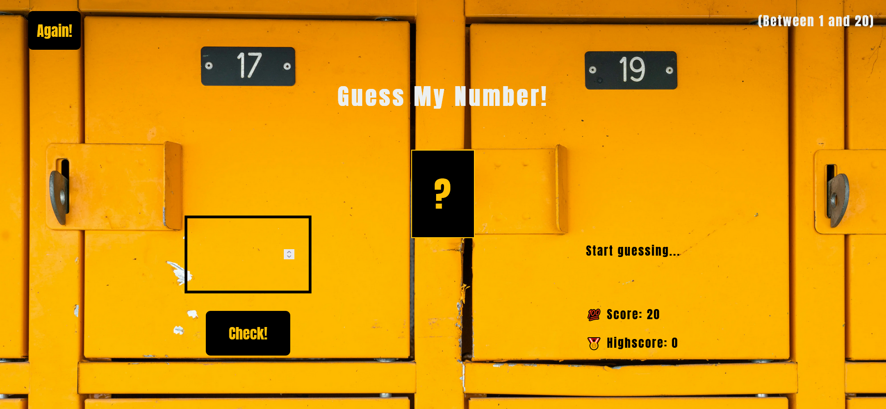

# Guess My Number

live site url: https://safensound95.github.io/guess-my-number/

Guess My Number is a simple browser game built with HTML/CSS and JavaScript.
The game starts with a secret number from 1 to 20, the user will have 20 chances to guess the secret number, and could play the game again as much as he'd like to achieve better scores.

As stated before, this project is rather 'simple', it's more of a training project showcasing especially DOM manipulation.

The project is largely based on one of the projects in Jonas Schmedtmann's Javascript course. an overhaul of some of the styles, plus fixing a couple of bugs in the original while adding a couple more features as well.
